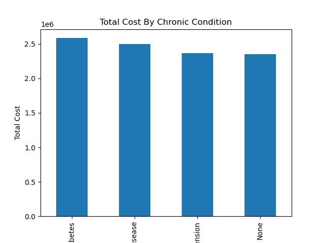

# Healthcare Claims Cost Analysis

## Database Creation

## Business Problem
A healthcare insurance company struggles with rising claim costs. 

## Project OverviewO
Analyze healthcare data in claims to highlight key cost drivers and, based on data-driven evidence, provide recommendations to reduce overall healthcare spending while improving patient outcomes and satisfaction.

## Tools Used
- Python (Anaconda, Pandas, Jupyter, NumPy, and Matplotlib)
- SQL (PostgreSQL and Bash)
- CSV File

## Main Insights
- Top 20% of patients contribute heavily to healthcare costs
- ER visits are the highest cost per visit average
- Chronic conditions like heart disease and diabetes are the main contributors to increased total spending
- Certain providers cost disproportionately compared to others
- Healthcare spending is impacted by seasonal trends

## Business Impact 
These data-driven insights can enable healthcare organizations to reduce unnecessary costs, improve organizational efficiency, and improve patient outcomes, care, and satisfaction.

## Files Included
- Jupyter Notebook with fill analysis
- CSV outputs from analysis
- Visualizations (Graphs)

  ## Sample Visualization of Database

  
  
